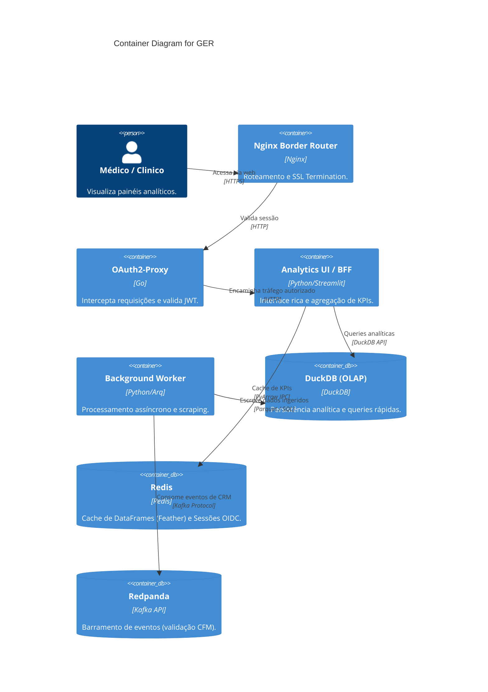

# C4 Containers Diagram — GER

> Generated by Reversa (Architect) on 2026-04-28
> Level: Detailed

## Communication Protocols

- **PyArrow IPC (Feather)**: Cache de DataFrames no Redis (~40-60% mais rápido que pickle).
- **Kafka Protocol**: Consumo assíncrono e DLQ.
