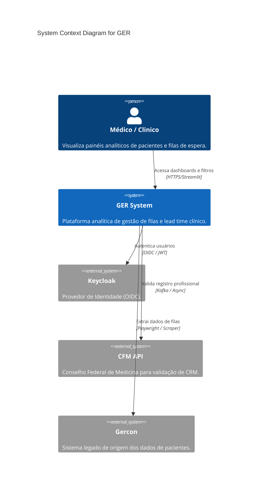

# C4 Context Diagram — GER

> Generated by Reversa (Architect) on 2026-04-28
> Level: Detailed

## Integrations

- **Keycloak**: OAuth2/OIDC para autenticação inicial.
- **CFM**: Validação assíncrona de CRM para garantir segurança Zero-Trust.
- **Gercon**: Extração via scraping tolerante a falhas.
