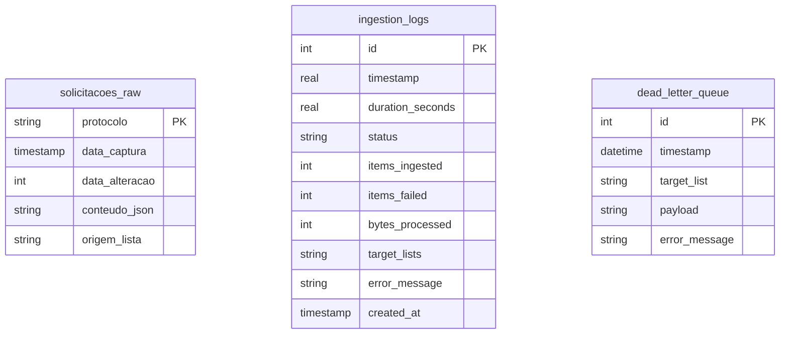
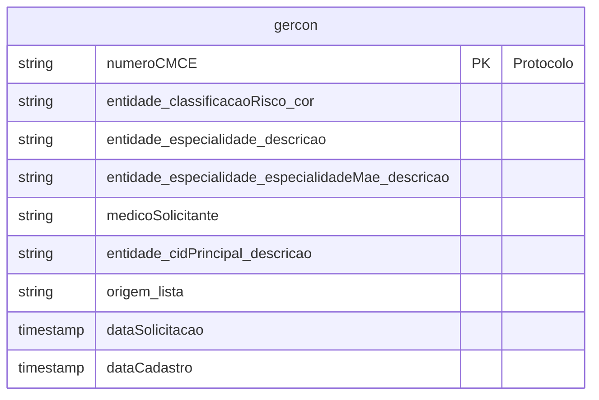

# Entity-Relationship Diagram — GER

> Generated by Reversa (Data Master) on 2026-04-28
> Phase: Revisão (Agente Independente)

Este diagrama mapea a persistência física dividida entre o banco SQLite de Auditoria/Watermark e a base analítica DuckDB.

## SQLite Database (`gercon_raw_data.db`)

## DuckDB Analytical View (`gercon`)

A view analítica é gerada dinamicamente a partir de arquivos Parquet.

## Relacionamentos Lógicos (Cross-Database)

Embora não existam Foreign Keys físicas:
- `gercon.numeroCMCE` <--> `solicitacoes_raw.protocolo` (Mapeamento 1:1)
