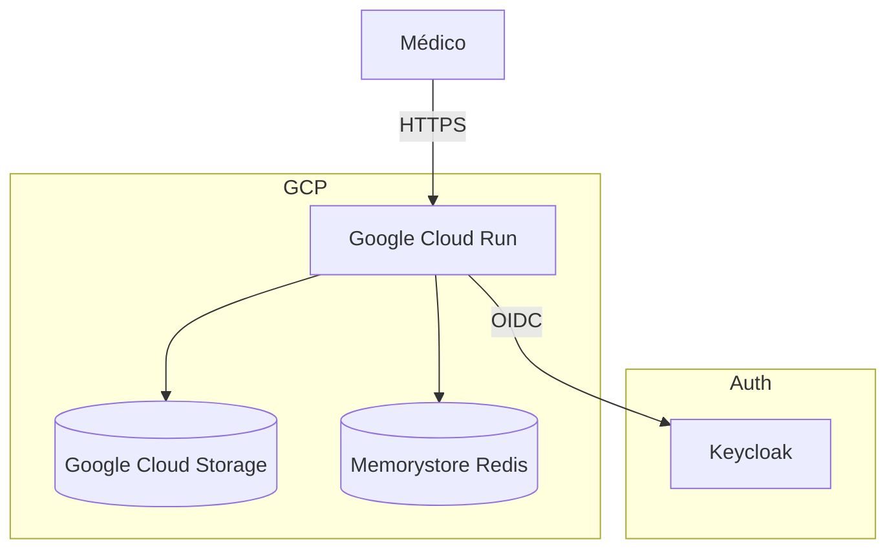

# Deployment & Infrastructure — GER

> Generated by Reversa (Architect) on 2026-04-28
> Level: Detailed

## 1. Production Deployment (Google Cloud Run)

O sistema é implantado de forma stateless no Google Cloud Run usando uma estratégia GitOps (Push-based).

## 2. Local Development (Docker Compose)

Para execução local, o ecossistema é levantado via Docker Compose:

- **`nginx`**: Ponto de entrada unificado.
- **`oauth2-proxy`**: Validação de cookies e redirecionamento.
- **`analytics`**: Streamlit UI.
- **`worker`**: Arq/Scraper.
- **`redpanda`**: Kafka assíncrono.
- **`redis`**: Cache.

## 3. Deployment Guardrails

- **Port Binding**: O container Streamlit deve se ligar dinamicamente à variável `$PORT` injetada pelo Cloud Run.
- **Data Freshness**: Volumes persistentes não são confiáveis em Serverless; o storage deve ser abstraído para S3/GCS (ADR-009).
