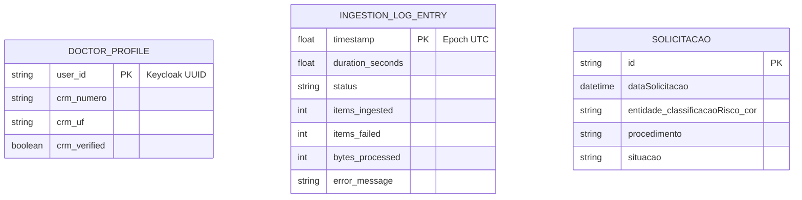

# Entity Relationship Diagram (ERD) — GER

> Generated by Reversa (Architect) on 2026-04-28
> Level: Detailed

## Data Invariants

- **DoctorProfile**: `crm_numero` e `crm_uf` formam um Value Object imutável.
- **IngestionLogEntry**: Status segue o enum `IngestionStatus`.
