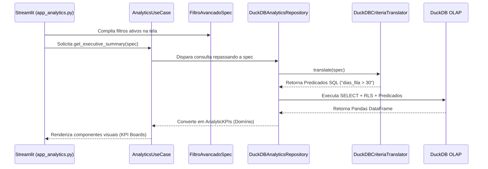
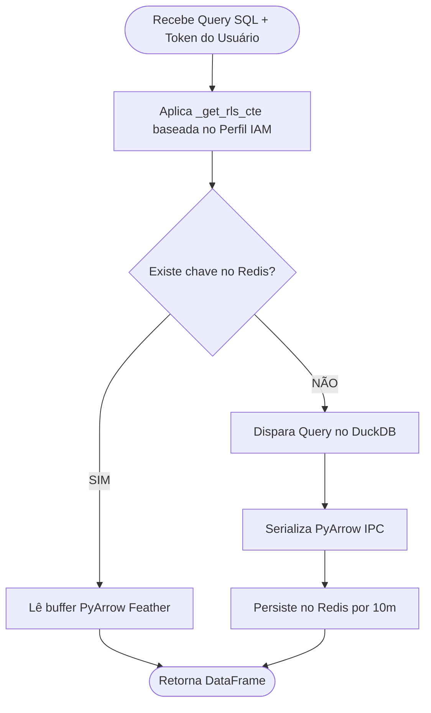

# Fluxos de Execução - Módulo Analytics

Este documento contém diagramas comportamentais do fluxo de dados e controle analítico.

## 1. Fluxo de Resolução de Consulta Analítica

A sequência abaixo ilustra o desacoplamento do domínio via Arquitetura Hexagonal durante o carregamento do dashboard.

## 2. Decisão de Cache Distribuído e RLS

Fluxo lógico do Adapter `DuckDBAnalyticsRepository` ao interagir com segurança e performance.

