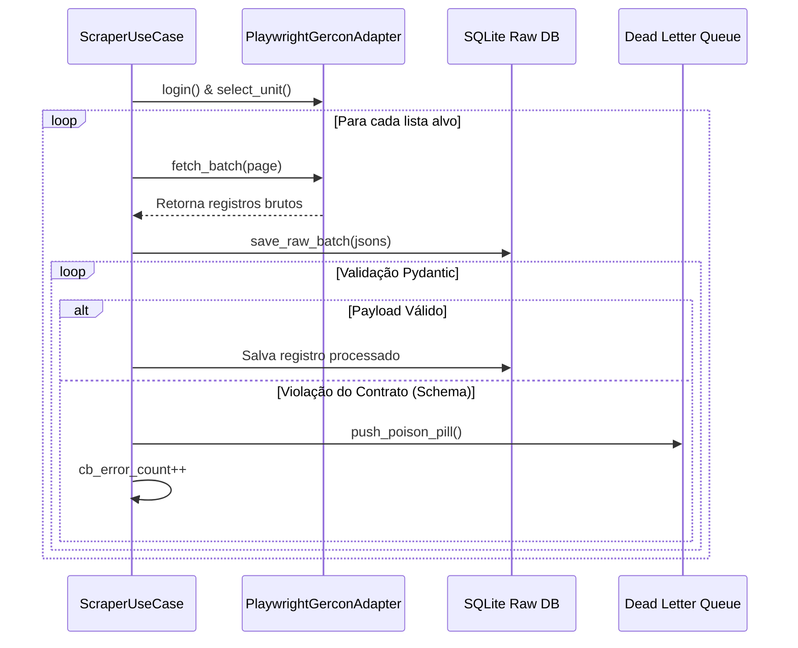
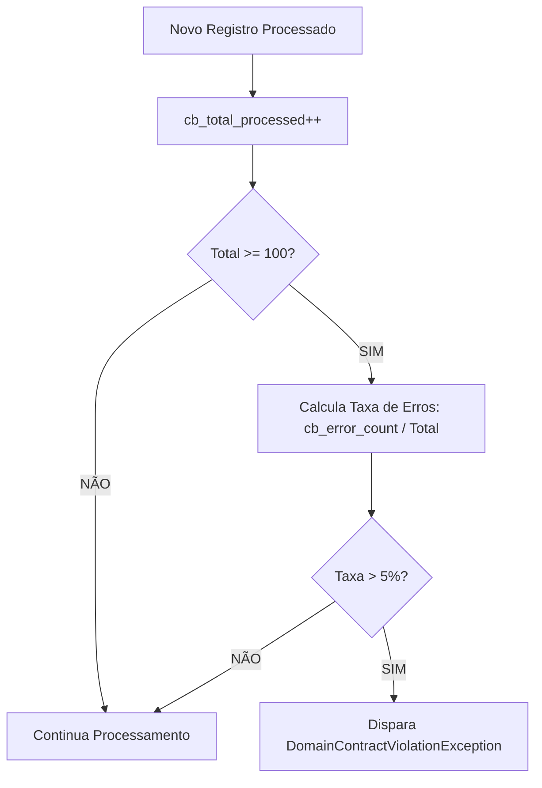

# Fluxos de Execução - Módulo Scraper

Diagramas comportamentais do robô de ingestão.

## 1. Fluxo do Ciclo de Ingestão

```mermaid
sequenceDiagram
    participant UC as ScraperUseCase
    participant Client as PlaywrightGerconAdapter
    participant DB as SQLite Raw DB
    participant DLQ as Dead Letter Queue

    UC->>Client: login() & select_unit()
    loop Para cada lista alvo
        UC->>Client: fetch_batch(page)
        Client-->>UC: Retorna registros brutos
        UC->>DB: save_raw_batch(jsons)
        loop Validação Pydantic
            alt Payload Válido
                UC->>DB: Salva registro processado
            else Violação do Contrato (Schema)
                UC->>DLQ: push_poison_pill()
                UC->>UC: cb_error_count++
            end
        end
    end
```

## 2. Algoritmo do Circuit Breaker

```mermaid
graph TD
    Start[Novo Registro Processado] --> IncTotal[cb_total_processed++]
    IncTotal --> CheckMin{Total >= 100?}
    CheckMin -- NÃO --> Normal[Continua Processamento]
    CheckMin -- SIM --> CalcRatio[Calcula Taxa de Erros: cb_error_count / Total]
    CalcRatio --> CheckRatio{Taxa > 5%?}
    CheckRatio -- NÃO --> Normal
    CheckRatio -- SIM --> Critical[Dispara DomainContractViolationException]
```
