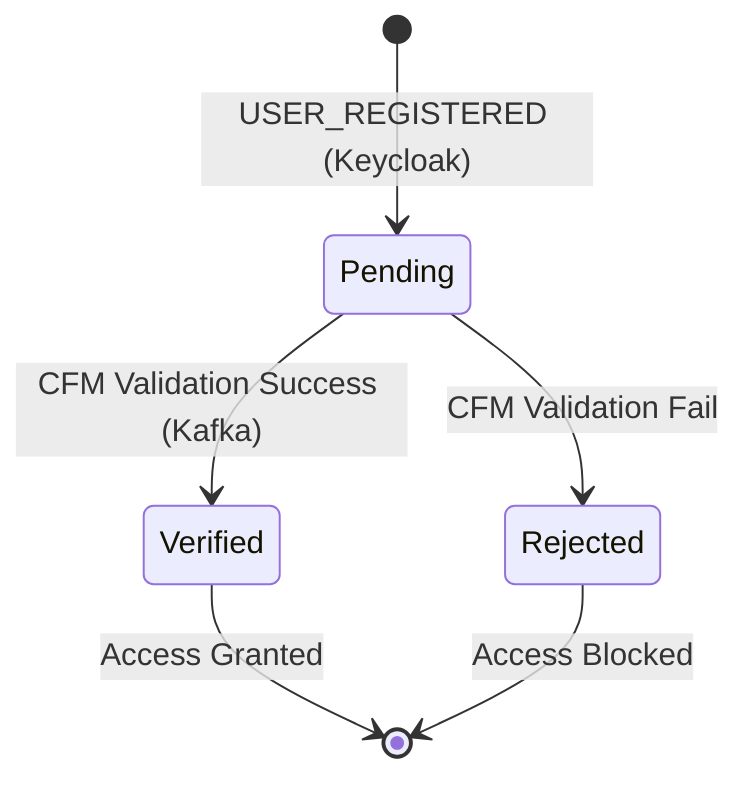
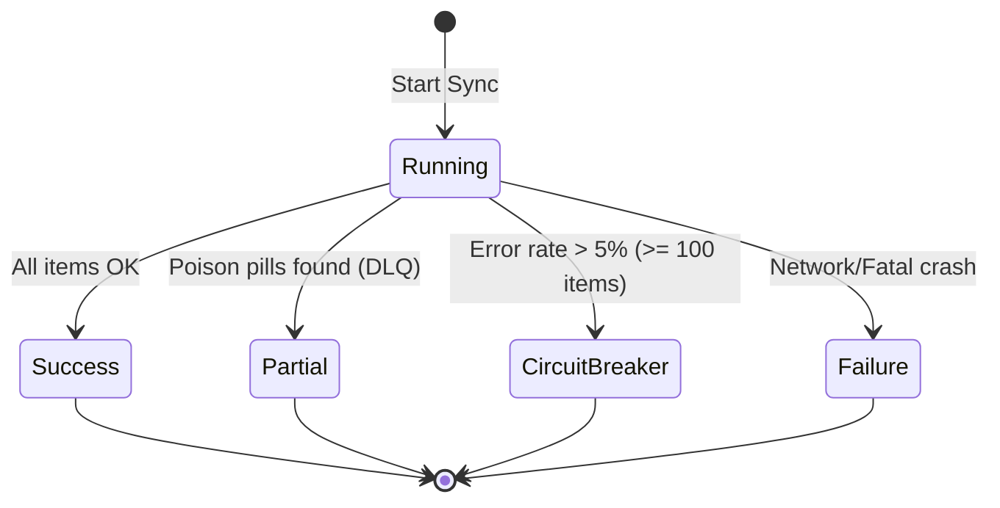

# State Machines — GER

> Generated by Reversa (Detective) on 2026-04-28
> Level: Detailed

## 1. Doctor Authorization Lifecycle

Mapeia o acesso baseado em CRM (Zero-Trust).

### Transitions

| Current State | Trigger | Target State | Guard / Action |
|---|---|---|---|
| `Pending` (`crm_verified=False`) | CFM API Success | `Verified` (`crm_verified=True`) | Persist status in DB. |
| `Pending` (`crm_verified=False`) | CFM API Fail | `Rejected` | Log exclusion/Keep False. |

---

## 2. Scraper Execution Status

Mapeia o ciclo de vida de uma execução do Worker.

### Transitions

| Current State | Condition | Target State | Action |
|---|---|---|---|
| `Running` | 100% processed without schema violations | `SUCCESS` | Log Audit Entry. |
| `Running` | Violations < 5% | `PARTIAL` | Push to DLQ + Continue. |
| `Running` | Violations > 5% | `CIRCUIT_BREAKER` | Raise `DomainContractViolationException`. |
| `Running` | Unhandled Exception | `FAILURE` | Capture by Sentry. |
